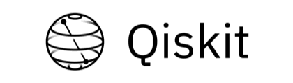

***

# Qiskit Tutorials

Welcome to the [Qiskit](https://www.qiskit.org/ tutorials!

In this repository, we've put together a collection of Jupyter notebooks aimed at teaching people who want to use Qiskit for writing quantum computing programs, and executing them on one of several backends (online quantum processors, online simulators, and local simulators). The online quantum processors are the [IBM Q](https://quantumexperience.ng.bluemix.net/qx/devices) devices.

## Installation and Setup

The notebooks for these tutorials can be viewed here on GitHub. But for the full experience, you'll want to interact with them!

The easiest way to do this is using [the Binder image](https://mybinder.org/v2/gh/Qiskit/qiskit-tutorial/master?filepath=index.ipynb), which lets you use the notebooks via the web. This means that you don't need to download or install anything, but it also means that you should not insert any private information into the notebooks (such as your API key). We recommend as pointed out in [issue #231](https://github.com/Qiskit/qiskit-tutorial/issues/231) that after you are done using mybinder that you regenerate your token.

Please refer to this [installation guide](INSTALL.md) for setting up Qiskit and the tutorials on your own machine (this is the recommended way).

***

## Contents
We have organized the tutorials into two sections:

### 1. [Qiskit notebooks](qiskit/)
We've collected a core reference set of notebooks in this section outlining the features of Qiskit. We will be keeping them up to date with the latest Qiskit version.  
- [Basics](qiskit/basics) is meant for those who are getting started.
- [Terra](qiskit/terra) is meant for those who want to study circuits.
- [Ignis](qiskit/ignis) is meant for those who want to study noise.
- [Aqua](qiskit/aqua) is meant for those who want to develop applications on NISQ computers.
- [Jupyter](qiskit/jupyter) is meant to highlight some cool Juypter features.

### 2. [Community notebooks](community/)
Teaching quantum computing and qiskit has many different paths of learning. We love our community, and we love the contributions so keep them coming. Because Qiskit is changing so much, at the moment we cant keep this updated, but there are some great notebooks in here. See:
- [Hello, Quantum World](community/hello_world/) learn from the community how to write your first quantum program.
- [Quantum Games](community/games/), learn quantum computing by having fun.
- [Quantum Information Science with Terra](community/terra/), learn about quantum information science with Qiskit Terra.
- [Textbook Quantum Algorithms](community/algorithms/), learn Qiskit from the textbook algorithms.
- [Quantum Algorithms](community/aqua/), learn about quantum algorithms for noisy near-term devices with Qiskit Aqua.
- [Teach Me Qiskit 2018](community/teach_me_qiskit_2018/), learn from the great contributions to the [Teach Me Qiskit award](https://www.ibm.com/blogs/research/2018/06/teach-qiskit-winner/).

To go through the tutorials, load up the [index.ipynb](index.ipynb) notebook and start learning.

***

## Contributing
If you would like to contribute to the tutorials, there are a number of ways to get involved:

* **Issues**: Issues can be reported with GitHub [issue reporting](https://github.com/Qiskit/qiskit-tutorial/issues) for this repository. Select `New issue`, fill in a descriptive title, and provide as much detail as is needed for the issue to be reproduced.
* **Notebooks**: If you would like to contribute a notebook, please create a [fork](https://help.github.com/articles/fork-a-repo/) of the repository from the `master` branch and create a [pull request](https://help.github.com/articles/about-pull-requests/) for your change. Note that new notebooks should be placed in the relevant part of the [Community](community/) section.

## Contributors
These tutorials are the work of our [Qiskitters](https://github.com/Qiskit/qiskit-tutorial/graphs/contributors) who contribute to the project at different levels.

## License
This project is licensed under the Apache License 2.0 - see the [LICENSE](https://github.com/QISKit/qiskit-tutorial/blob/master/LICENSE) file for details.
